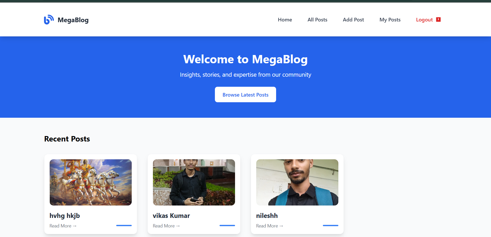

# MegaBlog 📝

A modern, full-featured blog application built with React, Redux Toolkit, and Appwrite. MegaBlog provides a complete blogging platform with user authentication, rich text editing, and responsive design.
- **Live link** [Mega-Blog-App](https://mega-blog-bay-two.vercel.app/)
## 🌟 Features

- **User Authentication**: Secure registration and login system
- **Rich Text Editor**: Create and edit posts with TinyMCE
- **Image Upload**: Featured images for posts with file management
- **Responsive Design**: Mobile-first approach with Tailwind CSS
- **State Management**: Redux Toolkit for efficient state handling
- **Protected Routes**: Authentication-based access control
- **Real-time Updates**: Dynamic content loading and updates
- **Modern UI**: Clean, intuitive interface with loading states
- **SEO Friendly**: Proper HTML structure and meta tags

## 🚀 Tech Stack

### Frontend
- **React 18** - Modern React with hooks and concurrent features
- **Redux Toolkit** - State management with simplified boilerplate
- **React Router DOM** - Client-side routing with protected routes
- **Tailwind CSS** - Utility-first CSS framework
- **Vite** - Fast build tool and development server

### Backend
- **Appwrite** - Backend-as-a-Service for authentication, database, and storage
- **TinyMCE** - Rich text editor for blog content creation

### Development Tools
- **ESLint** - Code linting and quality assurance
- **PostCSS** - CSS processing with Autoprefixer
- **React Hook Form** - Form handling with validation
- **HTML React Parser** - Safe HTML content rendering

## 📸 Screenshots

### Homepage

*Clean, modern homepage displaying featured blog posts*

### Login Page

*Secure user authentication with form validation*

### Rich Text Editor

*Powerful TinyMCE editor for creating and editing blog posts*

### All Posts View

*Grid layout showing all published blog posts*

### Mobile Responsive

*Fully responsive design optimized for mobile devices*

## 🛠️ Installation & Setup

### Prerequisites
- Node.js (v14 or higher)
- npm or yarn
- Appwrite account and project setup

### 1. Clone the Repository
```bash
git clone https://github.com/nilesh0198/megablog.git
cd megablog
```

### 2. Install Dependencies
```bash
npm install
```

### 3. Environment Variables
Create a `.env` file in the root directory and add your Appwrite credentials:

```env
VITE_APPWRITE_URL=your_appwrite_endpoint
VITE_APPWRITE_PROJECT_ID=your_project_id
VITE_APPWRITE_DATABASE_ID=your_database_id
VITE_APPWRITE_COLLECTION_ID=your_collection_id
VITE_APPWRITE_BUCKET_ID=your_bucket_id
```

### 4. Appwrite Setup
1. Create an Appwrite account at [appwrite.io](https://appwrite.io)
2. Create a new project
3. Set up a database with a collection for blog posts
4. Create a storage bucket for images
5. Configure authentication methods
6. Update your environment variables with the generated IDs

### 5. Run the Development Server
```bash
npm run dev
```

The application will be available at `http://localhost:5173`

## 📁 Project Structure

```
MegaBlog/
├── public/                     # Static assets
├── src/
│   ├── components/            # Reusable UI components
│   │   ├── Header/           # Navigation components
│   │   ├── Footer/           # Footer components
│   │   ├── container/        # Layout components
│   │   └── post-form/        # Post form components
│   ├── pages/                # Route-level components
│   ├── store/                # Redux store and slices
│   ├── appwrite/             # Appwrite service integration
│   ├── conf/                 # Configuration management
│   └── assets/               # Static assets
├── .env                      # Environment variables
├── .gitignore               # Git ignore rules
├── package.json             # Project dependencies
├── tailwind.config.js       # Tailwind configuration
├── vite.config.js          # Vite configuration
└── README.md               # Project documentation
```

## 🎯 Key Components

### Authentication System
- **AuthLayout**: Protected route wrapper
- **Login/Signup**: User authentication forms
- **LogoutBtn**: Session management

### Post Management
- **PostForm**: Create and edit posts with rich text editor
- **PostCard**: Individual post preview cards
- **RTE**: TinyMCE rich text editor integration

### UI Components
- **Button**: Reusable button component
- **Input**: Form input with validation
- **Select**: Dropdown selection component
- **Container**: Layout wrapper component

## 🔧 Available Scripts

- `npm run dev` - Start development server
- `npm run build` - Build for production
- `npm run preview` - Preview production build
- `npm run lint` - Run ESLint for code quality

## 🌐 Deployment

### Build for Production
```bash
npm run build
```

### Deploy to Vercel
1. Install Vercel CLI: `npm i -g vercel`
2. Run: `vercel`
3. Follow the prompts to deploy

### Deploy to Netlify
1. Build the project: `npm run build`
2. Drag and drop the `dist` folder to Netlify dashboard
3. Configure environment variables in Netlify settings

## 🔐 Environment Variables

| Variable | Description | Required |
|----------|-------------|----------|
| `VITE_APPWRITE_URL` | Appwrite server endpoint | ✅ |
| `VITE_APPWRITE_PROJECT_ID` | Appwrite project ID | ✅ |
| `VITE_APPWRITE_DATABASE_ID` | Database ID | ✅ |
| `VITE_APPWRITE_COLLECTION_ID` | Collection ID for posts | ✅ |
| `VITE_APPWRITE_BUCKET_ID` | Storage bucket ID for images | ✅ |

## 🤝 Contributing

1. Fork the repository
2. Create a feature branch: `git checkout -b feature/amazing-feature`
3. Commit your changes: `git commit -m 'Add amazing feature'`
4. Push to the branch: `git push origin feature/amazing-feature`
5. Open a Pull Request

## 📝 API Reference

### Authentication
- User registration and login
- Session management
- Password reset functionality

### Posts
- Create new blog posts
- Edit existing posts
- Delete posts
- Fetch all posts
- Fetch individual posts

### File Upload
- Image upload for featured images
- File validation and processing
- Image optimization

## 🐛 Known Issues

- [ ] Image upload size optimization needed
- [ ] Dark mode theme implementation pending
- [ ] Search functionality to be added
- [ ] Comment system for posts

## 🔮 Future Enhancements

- [ ] Dark/Light theme toggle
- [ ] Advanced search and filtering
- [ ] Comment system
- [ ] Social media sharing
- [ ] Email notifications
- [ ] Admin dashboard
- [ ] Analytics integration
- [ ] SEO optimization
- [ ] Progressive Web App (PWA) features

## 📊 Performance

- **Bundle Size**: Optimized with Vite and tree-shaking
- **Loading Speed**: Lazy loading for routes and components
- **SEO**: Server-side rendering ready
- **Accessibility**: WCAG 2.1 compliant components

## 🔒 Security

- **Authentication**: Secure JWT-based authentication via Appwrite
- **Data Validation**: Client and server-side validation
- **CORS**: Properly configured cross-origin requests
- **Environment Variables**: Sensitive data protection


## 👨‍💻 Author

**Nilesh Kumar**
- GitHub: [@nilesh0198](https://github.com/nilesh0198)
- LinkedIn: [LinkedIn](https://linkedin.com/in/nilesh0198)
- Email: nilesh0051bgs@gmail.com

## 🙏 Acknowledgments

- [Appwrite](https://appwrite.io) for the amazing BaaS platform
- [Tailwind CSS](https://tailwindcss.com) for the utility-first CSS framework
- [TinyMCE](https://www.tiny.cloud) for the rich text editor
- [React](https://reactjs.org) for the powerful frontend library
- [Vite](https://vitejs.dev) for the blazing fast build tool

---

⭐ Star this repository if you found it helpful!

## 📞 Support

If you have any questions or need help, please:
1. Check the [Issues](https://github.com/nilesh0198/mega-blog-app/issues) page
2. Create a new issue if your problem isn't already reported
3. Reach out via email or social media

Happy blogging! 🎉
